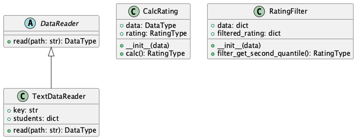

# Лабораторная 1 по дисциплине "Технологии программирования"
Цели работы:
1.Познакомиться с распределенной системой контроля версий кода Git и ее функциями;
2.Познакомиться с понятиями «непрерывная интеграция» (CI) и «непрерывное развертывание» (CD), определить их место в современной разработке программного обеспечения;
3.Получить навыки разработки ООП-программ и написания модульных тестов к ним на современных языках программирования;
4.Получить навыки работы с системой Git для хранения и управления версиями ПО;
5.Получить навыки управления автоматизированным тестированием программного обеспечения, расположенного в системе Git, с помощью инструмента GitHub Actions.

## Индивидуальный вариант - 1
Формат файла - YAML:

Рассчитать и вывести на экран количество студентов-отличников (имеющих баллы по всем предметам ≥ 90).

## Диаграмма классов

## Структура проекта
- data/data.yaml — файл данных для обработки в формате YAML.
- src/CalcRating.py — содержит класс с логикой расчёта рейтинга студентов.
- src/DataReader.py — базовый абстрактный класс для обработки данных из файлов.
- src/TextDataReader.py — содержит класс для обработки данных из текстовых файлов.
- src/YAMLDataReader.py — класс для обработки данных из файлов формата YAML.
- test/test_CalcRating.py — тесты для проверки логики расчёта.
- test/test_TextDataReader.py — тесты для обработки текстовых файлов.
- test/test_YAMLDataReader.py — тесты для обработки данных из YAML-файлов.
- requirements.txt — список необходимых библиотек для работы проекта.

## Выводы по работе:
В этой лабораторной работе я научился работать с различными форматами данных (YAML и TXT), разработал модульные классы для обработки данных и вычисления рейтингов, познакомился с принципами модульного тестирования, а также приобрел навыки создания и выполнения тестов с использованием библиотеки Pytest.

Я реализовал UML-диаграмму классов, структурировал проект в соответствии с современными стандартами разработки, получил навыки работы с системой контроля версий Git и организовал автоматическое тестирование с использованием GitHub Actions. Работа помогла мне понять важность тестирования и структуры проекта для обеспечения качества программного обеспечения.
